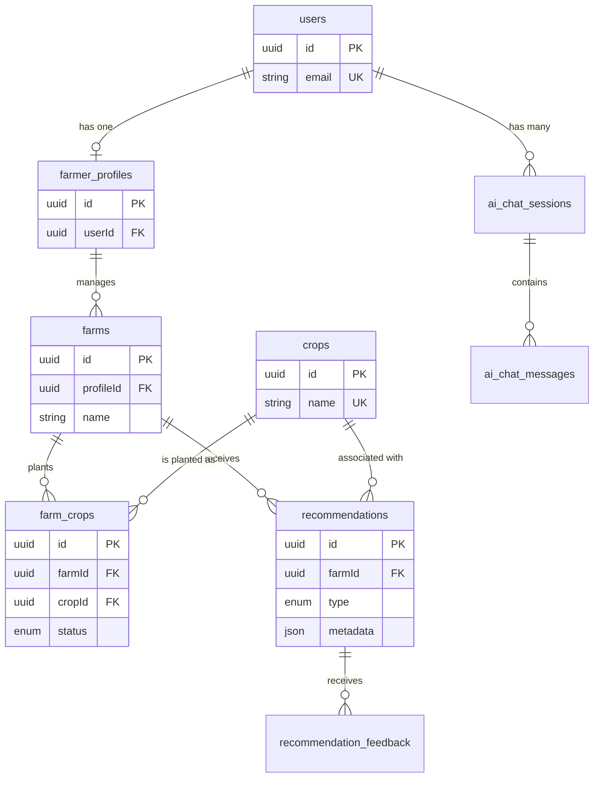

# 🌾 AgriCopilot

> Multi-Agent AI Platform for Crop Planning, Profit Prediction, and Farmer Decision Support

## Overview

AgriCopilot is an AI-powered agricultural decision support platform designed to help farmers make informed and data-driven decisions. The platform combines multiple specialized AI agents to provide crop recommendations, weather-based insights, market intelligence, and personalized farming assistance through a conversational interface.

The goal of AgriCopilot is to improve agricultural productivity and profitability by delivering actionable insights in a simple and accessible manner.

## Problem Statement

Farmers often struggle to access reliable information regarding crop selection, weather conditions, market prices, and government support schemes. AgriCopilot aims to centralize these services into a single intelligent platform.

## Key Features

* 🌦️ Weather Analysis Agent
* 🌱 Crop Recommendation Agent
* 📈 Market Intelligence & Profit Prediction
* 🏛️ Government Scheme Recommendation Agent
* 🤖 Conversational AI Copilot
* 📚 RAG-based Agricultural Knowledge Assistant
* 👨‍🌾 Personalized Farmer Dashboard

## Tech Stack

### Frontend

* React
* Tailwind CSS
* React Router

### Backend

* Node.js
* Express.js

### AI Services

* Python
* FastAPI
* LangChain
* Gemini API

### Database

* PostgreSQL

## Project Structure

```text
AgriCopilot/
├── frontend/
├── backend/
├── ai-service/
├── database/
├── docs/
├── datasets/
├── deployment/
├── README.md
└── .gitignore
```

## Development Roadmap

### Week 1
* Project Planning
* Architecture Design
* Repository Setup

### Week 2
* Frontend Foundations

### Week 3
* UI/UX & Component Design

### Week 4
* Backend & API Development

### Week 5
* Database Design & Management

### Week 6
* Authentication & Security

### Week 7
* AI Integration

### Week 8
* Frontend Integration & Polish

### Week 9
* Deployment

### Week 10
* Documentation & Portfolio

## Current Status

✅ Week 1 Completed
✅ Week 2 Completed
✅ Week 3 Completed
✅ Week 4 Completed
✅ Week 5 Completed
✅ Week 6 Completed
✅ Week 7 Completed

### Completed Work

#### Week 1

* Project ideation and scope definition
* System architecture design
* Repository initialization
* Development roadmap creation
* Technology stack finalization

#### Week 2

* React + Vite application setup
* Tailwind CSS integration
* React Router configuration
* Responsive navigation system
* Home page development
* About page development
* Dashboard page development
* Login page development
* Reusable UI components
* Premium SaaS-inspired UI design
* Mobile responsive layouts

#### Week 3

* Designed low-fidelity wireframes in Figma
* Created reusable UI component library
* Implemented Button component with multiple variants and sizes
* Implemented reusable Input component with validation support
* Developed Modal component with keyboard accessibility
* Added Toast notification system
* Built Loader and Skeleton loading components
* Created centralized UI component exports
* Developed Component Showcase page
* Implemented Dark/Light theme system
* Added theme persistence using localStorage
* Improved dashboard UI and user experience
* Optimized layouts for desktop, tablet, and mobile devices
* Tested responsiveness across 1440px, 768px, and 375px viewports

#### Week 4

**Backend**
* Express.js backend setup
* REST API architecture
* Crop Management API
* CRUD endpoints
* Search endpoint
* Request validation
* Centralized error handling middleware
* Environment variable support
* CORS configuration
* Health check endpoint
* In-memory data storage

**Frontend Integration**
* Connected React frontend to backend
* Axios API service layer
* Dynamic crop data rendering
* Loading state
* Error state
* API integration with Dashboard

#### Week 5

**Database & Architecture**
* Enterprise Repository Pattern Architecture
* Service & Controller Layers implementation
* PostgreSQL integration via Supabase Pooler
* Prisma ORM schema design & migrations
* Zod validation middleware for all endpoints
* Unified Dashboard composite endpoint
* Database seeding with master catalog data
* Full modular routing for Users, Farms, Recommendations, and AI Chat

#### Week 6

**Authentication & Security**
* Implemented Authentication using JWT and Passport (Google OAuth)
* Added secure password hashing (bcryptjs) and validation (Zod)
* Developed Backend Authentication Routes (`/register`, `/login`, `/google`)
* Implemented Rate Limiting (express-rate-limit) to prevent brute-force attacks
* Added Authentication State context to Frontend (AuthContext, ProtectedRoute)
* Created seamless Google OAuth redirect flow and UX improvements
* Built interactive `FarmSetup` onboarding flow for newly registered users
* Added dynamic user-scoped "Add Crop" functionality to the Dashboard
* Implemented automatic Dashboard navigation for authenticated users

#### Week 7

**AI Integration**
* Integrated Google Gemini AI (`gemini-3.5-flash`) via the `@google/genai` SDK
* Created an interactive `AiChatModal` component for a seamless Copilot experience
* Implemented backend chat service to handle context history and system instructions
* Added dynamic loading and error states to the UI
* Configured environment variables for secure API key management
* Documented prompt engineering and tested 3 variations in `PROMPTS.md`

### Current Application Pages

* Home
* About
* Dashboard
* Login

### Current Features

#### Frontend
* Responsive Navbar
* Hero Section
* Feature Cards
* Dashboard Widgets
* Mobile Navigation Menu
* Modern Footer
* Responsive Layout
* Dark / Light Theme Support
* Theme Persistence
* Component Showcase Page
* Reusable UI Component Library
* Toast Notifications
* Modal System
* Skeleton Loaders
* Backend API Integration
* Dynamic Dashboard Data
* Loading State
* Error Handling

#### Backend
* Express REST API
* CRUD Operations
* Search Functionality
* Request Validation
* Error Handling Middleware
* CORS
* Environment Variables
* PostgreSQL Database
* Prisma ORM
* Repository Pattern
* Enterprise Architecture

### API Endpoints

| Method | Endpoint | Description |
|--------|----------|-------------|
| GET | `/api/crops` | Fetch a list of all crops |
| GET | `/api/crops/:id` | Fetch details of a single crop by ID |
| POST | `/api/crops` | Create a new crop record |
| PUT | `/api/crops/:id` | Update an existing crop by ID |
| DELETE | `/api/crops/:id` | Delete a crop by ID |
| GET | `/api/crops/search?q=` | Search crops by name or season |

### New Enterprise Endpoints (Week 5)

| Method | Endpoint | Description |
|--------|----------|-------------|
| GET | `/api/dashboard` | Aggregated dashboard telemetry and data |
| POST | `/api/users/register` | Register a new user |
| GET | `/api/farms/profile/:id` | Get farms for a profile |
| POST | `/api/recommendations` | Generate an AI recommendation |
| POST | `/api/chat/message` | Send message to AI Copilot |

### UI Component Library

The application includes a reusable component system located in:

```text
src/components/ui/
```

Components:

* Button
* Input
* Modal
* Toast
* Loader
* Card
* ThemeToggle

These components are designed to promote consistency, maintainability, and scalability across the application.

### Next Milestone

Week 8: Frontend Integration & Polish

Upcoming Focus:

* Connect remaining backend APIs to frontend
* Polish UI components
* Implement advanced state management
* Add empty states and animations

## Internship Progress

| Week | Module | Status |
|--------|--------|--------|
| Week 1 | Project Setup & Planning | ✅ Completed |
| Week 2 | Frontend Foundations | ✅ Completed |
| Week 3 | UI/UX & Component Design | ✅ Completed |
| Week 4 | Backend & API Development | ✅ Completed |
| Week 5 | Database Design & Management | ✅ Completed |
| Week 6 | Authentication & Security | ✅ Completed |
| Week 7 | AI Integration | ✅ Completed |
| Week 8 | Frontend Integration & Polish | ⏳ Pending |
| Week 9 | Deployment | ⏳ Pending |
| Week 10 | Documentation & Portfolio | ⏳ Pending |


## Setup Instructions

### Frontend Setup

Clone the repository:

```bash
git clone https://github.com/YOUR_USERNAME/AgriCopilot.git
cd AgriCopilot/frontend
```

Install dependencies:

```bash
npm install
```

Start development server:

```bash
npm run dev
```

### Database Setup

Our backend uses PostgreSQL and Prisma ORM. Follow these steps to initialize your database:

1. Ensure you are in the `backend` directory.
2. Create a `.env` file in the root of the `backend` directory:
   ```bash
   cp .env.example .env
   ```
3. Update the `DATABASE_URL` in `.env` with your PostgreSQL connection string (we use Supabase).
4. Run Prisma migrations to generate the tables:
   ```bash
   npx prisma migrate dev --name init
   ```
5. Seed the database with initial crops and mock data:
   ```bash
   npx prisma db seed
   ```

### Backend Setup

Navigate to the backend directory:

```bash
cd ../backend
```
*(or `cd backend` from the root)*

Install dependencies:

```bash
npm install
```

Start development server:

```bash
npm run dev
```

**Local URLs:**
* Frontend URL: `http://localhost:5173`
* Backend URL: `http://localhost:3000`

### Dependencies

#### Frontend
* React
* Vite
* Tailwind CSS v4
* React Router DOM
* Lucide React
* Axios

#### Backend
* Express
* CORS
* dotenv
* Nodemon
* Prisma
* Zod
* PostgreSQL (Supabase)

### Database & AI Services

#### Database Choice & Architecture
AgriCopilot is built on **PostgreSQL (via Supabase)** using **Prisma ORM**. 
- **Relational Integrity**: As an enterprise app, we have strict relationships between Users, Farms, Crops, and AI Recommendations. PostgreSQL ensures ACID compliance and strict foreign key constraints.
- **JSONB Support**: Our AI Copilot relies on storing unstructured model metadata (like LLM prompts, token counts, and prediction confidence intervals). PostgreSQL's `JSONB` column type is perfect for hybrid structured/unstructured AI data.
- **Prisma ORM**: Provides ultimate type-safety and rapid schema migrations, acting as the perfect bridge between our Express/TypeScript backend and Postgres.

#### Schema Diagram
Below is the ER schema diagram mapping our database architecture:



Authentication and AI services will be implemented in upcoming development phases.

## Author

Rahul Mehta
