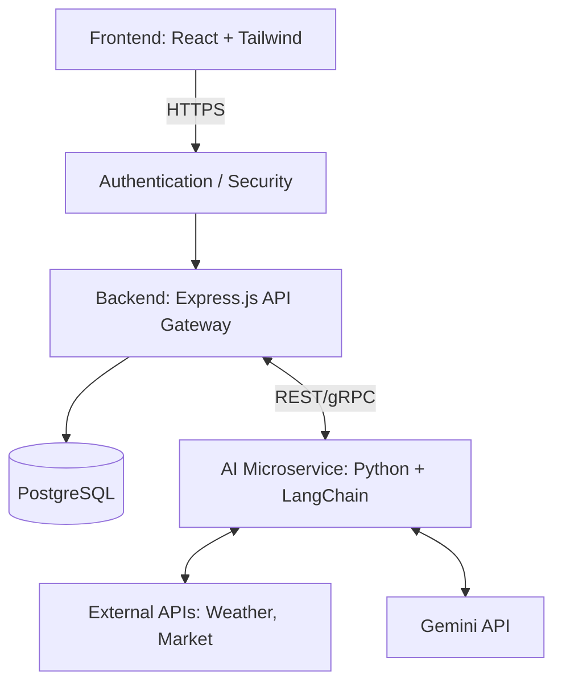
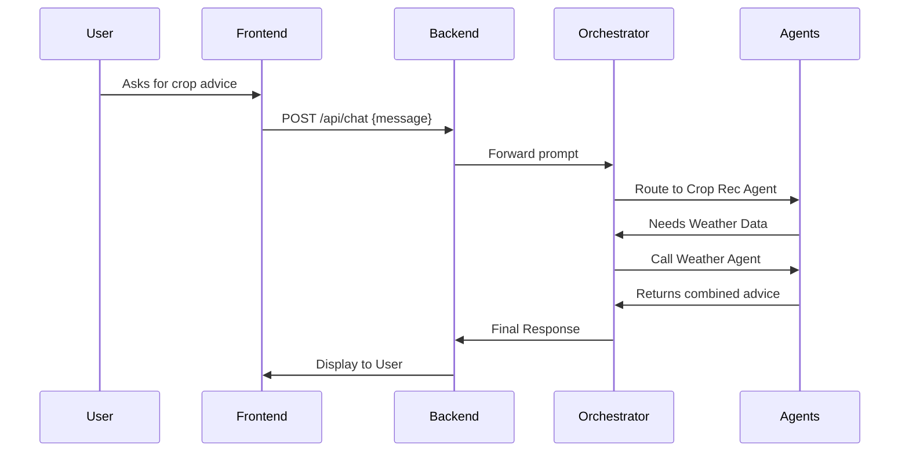
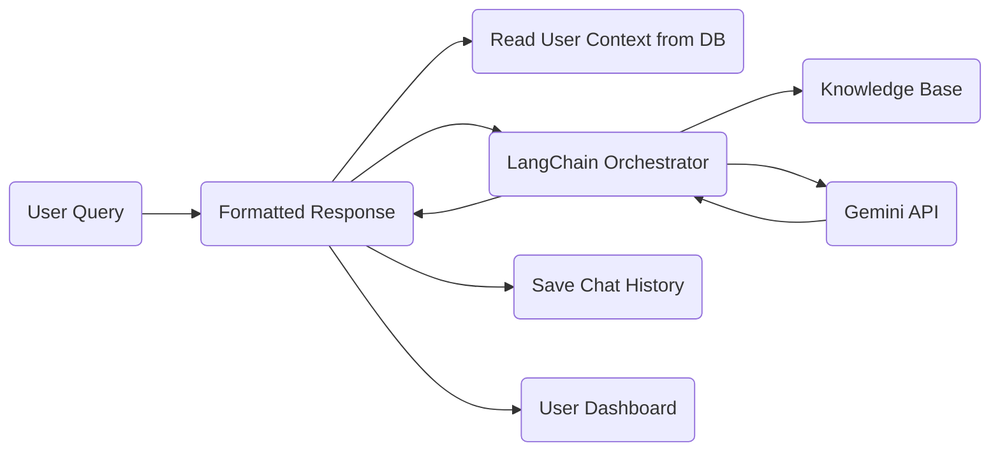

# AgriCopilot: Architecture & Project Plan

## PART 1 – Project Architecture

### High-Level System Architecture



### Component Architecture

1. **Frontend (React)**: 
   - **UI Layer**: Reusable Tailwind components (Buttons, Modals, Cards).
   - **State Management**: Context API or Redux for user session, agent chat history.
   - **Pages**: Dashboard, Chat Interface, Settings, Crop Planner.
2. **Backend (Node/Express)**:
   - **Controllers**: Handle HTTP requests, input validation.
   - **Services**: Business logic, user management, db interactions.
   - **Data Access Layer**: TypeORM or Prisma for PostgreSQL queries.
3. **AI Services (Python)**:
   - **Agent Orchestrator**: LangChain routing requests to specific sub-agents.
   - **MVP Agents**: Conversational Copilot, Weather Agent, Crop Recommendation Agent.
   - **Phase 2 / Stretch Goals**: Market Price Prediction, Government Scheme Agent, Full RAG Knowledge Base.

### Multi-Agent Workflow



### Data Flow Diagram



### API Communication Flow
- **Client ↔ Backend**: RESTful APIs over HTTPS with JSON payloads. JWT for authentication.
- **Backend ↔ Database**: TCP/IP (PostgreSQL protocol) using connection pooling.
- **Backend ↔ AI Service**: Internal REST API or gRPC. Python FastAPI is recommended to wrap the LangChain services.
- **AI Service ↔ Gemini API**: HTTPS calls to Google Cloud/Gemini API endpoints.

### Recommended Folder Structure

```text
agricopilot/
├── client/                 # React Frontend
│   ├── public/
│   ├── src/
│   │   ├── components/     # Reusable UI components
│   │   ├── pages/          # Route components (Dashboard, Chat)
│   │   ├── services/       # API integration
│   │   ├── context/        # State management
│   │   └── utils/          # Helpers
├── server/                 # Node.js Backend
│   ├── src/
│   │   ├── controllers/
│   │   ├── models/         # DB schemas
│   │   ├── routes/
│   │   ├── middlewares/    # Auth, error handling
│   │   └── utils/
├── ai-service/             # Python AI Microservice
│   ├── agents/             # LangChain agent definitions
│   ├── tools/              # Custom tools (Weather API, Market API)
│   ├── rag/                # Vector DB setup and embeddings
│   ├── main.py             # FastAPI entry point
│   └── requirements.txt
├── .gitignore
├── docker-compose.yml      # Local dev environment
└── README.md
```

## PART 2 – Scope Validation

### Feasibility Analysis (10 Weeks)
Building a fully-featured, multi-agent AI platform with a robust frontend, backend, and integrated LLM services in 10 weeks is **highly ambitious**. It is achievable *only* if strict scoping is applied, focusing on core MVP features first and using pre-built UI components (e.g., shadcn/ui or Headless UI) to accelerate frontend development.

### MVP (Must-Have) Features
1. **Farmer Dashboard**: A unified view for user data and saved recommendations.
2. **Conversational Copilot**: The primary chat interface for users to interact with the system.
3. **Weather Agent**: Integrating a free Weather API (e.g., OpenWeatherMap) via LangChain tool.
4. **Crop Recommendation Agent**: Using Gemini API and basic static agricultural data.
5. **Authentication**: Robust user login and profile management.

### Phase 2 / Stretch Goals
1. **Market Price Prediction**: Real-time market data pipelines and forecasting.
2. **Government Scheme Agent**: Targeted suggestions for farmer assistance programs.
3. **Full RAG Knowledge Base**: Advanced multi-document vector search for agricultural best practices.

### Major Technical Risks
1. **Latency in Multi-Agent Execution**: Sequential agent calls can take 10+ seconds, degrading user experience. *Mitigation: Stream responses or use WebSockets.*
2. **Prompt Injection & Hallucinations**: AI agents might provide incorrect agricultural advice which can cause crop failure. *Mitigation: Implement strict system prompts, ground truth via RAG, and display disclaimers.*
3. **Integration Complexity**: Connecting Node.js, Python, and PostgreSQL seamlessly. *Mitigation: Establish strict API contracts via Swagger/OpenAPI early on.*

### Recommended Implementation Order
1. **Database & Backend Basics**: Users, auth, basic API structure.
2. **Frontend Foundations**: Routing, layout, auth screens.
3. **Core AI Service (Python)**: Setup FastAPI, LangChain, and a basic conversational agent.
4. **Specialized Agents**: Add weather tool, then crop recommendation.
5. **Integration**: Connect Express backend to Python AI service, then to React frontend.
6. **Refinement**: Dashboard UI, RAG integration, error handling, and polish.

